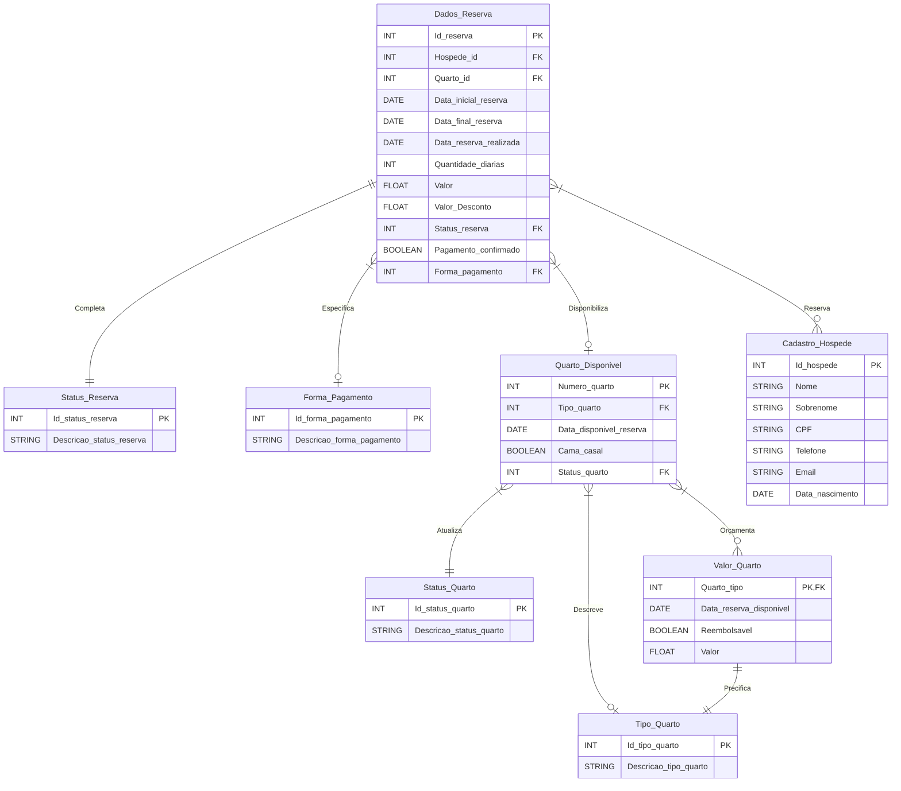

# Sprint V - BD: Create e Read + Apresentação do PI

**Espera-se que o aluno consiga executar as seguintes atividades:**

### Desenvolvimento

- Modelar o Der (Diagrama Entidade Relacionamento) de uma parte do sistema com 4 entidades no mínimo;
- Criar tabelas na 3FN em um banco de dados com informações de teste;
- Realizar consultas simples, se possível, juntando tabelas.

### Organização

- Uso de recursos de apresentação (slides, demonstração de uso do app, etc);
- Uso do Git;
- Uso do SQL;
- Uso do Discord para comunicação da equipe.

### Apresentação

- Construir a apresentação do pitch pela equipe;
- Submeter o projeto para avaliação final.

## Modelo do Diagrama Entidade Relacionamento



## Tabelas na 3FN

### Criação das Tabelas

```sql
-- 5. Tipo de Quarto
CREATE TABLE Tipo_Quarto (
    Id_tipo_quarto SERIAL PRIMARY KEY,
    Descricao_tipo_quarto VARCHAR(30) UNIQUE -- Adiciona a restrição UNIQUE
);

-- 6. Status Quarto
CREATE TABLE Status_Quarto (
    Id_status_quarto SERIAL PRIMARY KEY,
    Descricao_status_quarto VARCHAR(15)
);

-- 7. Status Reserva
CREATE TABLE Status_Reserva (
    Id_status_reserva SERIAL PRIMARY KEY,
    Descricao_status_reserva VARCHAR(15) UNIQUE
);

-- 8. Forma de Pagamento
CREATE TABLE Forma_Pagamento (
    Id_forma_pagamento SERIAL PRIMARY KEY,
    Descricao_forma_pagamento VARCHAR(30) UNIQUE
);

-- 2. Quarto Disponivel
CREATE TABLE Quarto_Disponivel (
    Numero_quarto INT PRIMARY KEY,
    Tipo_quarto INT,
    Data_disponivel_reserva DATE,
    Cama_casal BOOLEAN,
    Status_quarto INT,
    FOREIGN KEY (Tipo_quarto) REFERENCES Tipo_Quarto(Id_tipo_quarto),
    FOREIGN KEY (Status_quarto) REFERENCES Status_Quarto(Id_status_quarto)
);

-- 3. Valor Quarto
CREATE TABLE Valor_Quarto (
    Quarto_tipo INT PRIMARY KEY,
    Data_reserva_disponivel DATE,
    Reembolsavel BOOLEAN,
    Valor FLOAT,
    FOREIGN KEY (Quarto_tipo) REFERENCES Tipo_Quarto(Id_tipo_quarto)
);

-- 1. Cadastro do Hospede
CREATE TABLE Cadastro_Hospede (
    Id_hospede SERIAL PRIMARY KEY,
    Nome VARCHAR(30),
    Sobrenome VARCHAR(70),
    CPF VARCHAR(11),
    Telefone VARCHAR(15),
    Email VARCHAR(40),
    Data_nascimento DATE
);

-- 4. Dados Reserva
CREATE TABLE Dados_Reserva (
    Id_reserva SERIAL PRIMARY KEY,
    Hospede_id INT,
    Quarto_id INT,
    Data_inicial_reserva DATE,
    Data_final_reserva DATE,
    Data_reserva_realizada DATE,
    Quantidade_diarias INT,
    Valor FLOAT,
    Valor_Desconto FLOAT,
    Status_reserva INT,
    Pagamento_confirmado BOOLEAN,
    Forma_pagamento INT,
    FOREIGN KEY (Hospede_id) REFERENCES Cadastro_Hospede(id_hospede),
    FOREIGN KEY (Quarto_id) REFERENCES Quarto_Disponivel(Numero_quarto),
    FOREIGN KEY (Status_reserva) REFERENCES Status_Reserva(id_status_reserva),
    FOREIGN KEY (Forma_pagamento) REFERENCES Forma_Pagamento(id_forma_pagamento)
);
```

### Informações de teste

```sql
-- Adicionando dados à tabela Tipo_Quarto
INSERT INTO Tipo_Quarto (Descricao_tipo_quarto) VALUES
    ('Single'),
    ('Duplo'),
    ('Triplo'),
    ('Suíte Luxo');

SELECT * FROM tipo_quarto -- Vefica se foi inserido

-- Adicionando dados à tabela Status_Quarto
INSERT INTO Status_Quarto (Descricao_status_quarto) VALUES
    ('Disponível'),
    ('Ocupado'),
    ('Manutenção');

SELECT * FROM Status_Quarto  -- Vefica se foi inserido

-- Adicionando dados à tabela Status_Reserva
INSERT INTO Status_Reserva (Descricao_status_reserva) VALUES
    ('Pendente'),
    ('Confirmada'),
    ('Cancelada');

SELECT * FROM Status_Reserva  -- Vefica se foi inserido

-- Adicionando dados à tabela Forma_Pagamento
INSERT INTO Forma_Pagamento (Descricao_forma_pagamento) VALUES
    ('Cartão de Crédito'),
    ('Cartão de Débito'),
    ('Dinheiro'),
    ('Pix');

SELECT * FROM Forma_Pagamento  -- Vefica se foi inserido

-- Adicionando dados à tabela Quarto_Disponivel
INSERT INTO Quarto_Disponivel (Numero_quarto, Tipo_quarto, Data_disponivel_reserva, Cama_casal, Status_quarto) VALUES
    (101, 1, '2023-11-20', true, 1),
    (201, 2, '2023-11-20', false, 1),
    (201, 2, '2023-11-21', false, 3),
    (301, 3, '2023-11-20', true, 2),
    (301, 3, '2023-11-21', true, 2),
    (401, 4, '2023-11-20', false, 1),
    (401, 4, '2023-11-21', false, 3);

SELECT * FROM Quarto_Disponivel  -- Vefica se foi inserido

-- Adicionando dados à tabela Valor_Quarto
INSERT INTO Valor_Quarto (Quarto_tipo, Data_reserva_disponivel, Reembolsavel, Valor) VALUES
    (1, '2023-11-20', true, 150.00),
    (2, '2023-11-20', true, 200.00),
    (3, '2023-11-21', true, 250.00),
    (4, '2023-11-21', false, 500.00);

SELECT * FROM Valor_Quarto  -- Vefica se foi inserido

-- Adicionando dados à tabela Cadastro_Hospede
INSERT INTO Cadastro_Hospede (Nome, CPF, Telefone, Email, Data_nascimento) VALUES
    ('João Silva', '12345678909', '(11) 98765-4321', 'joao.silva@email.com', '1990-01-15'),
    ('Maria Oliveira', '98765432109', '(21) 98765-1234', 'maria.oliveira@email.com', '1985-05-20');

SELECT * FROM Cadastro_Hospede  -- Vefica se foi inserido

-- Adicionando dados à tabela Dados_Reserva
INSERT INTO Dados_Reserva (Hospede_id, Quarto_id, Data_inicial_reserva, Data_final_reserva, Data_reserva_realizada, Quantidade_diarias, Valor, Valor_Desconto, Status_reserva, Pagamento_confirmado, Forma_pagamento) VALUES
    (1, 101, '2023-11-22', '2023-11-25', '2023-11-20', 3, 400.00, 0.00, 1, true, 1),
    (2, 201, '2023-11-23', '2023-11-25', '2023-11-21', 2, 300.00, 50.00, 2, false, 2);

SELECT * FROM Dados_Reserva  -- Vefica se foi inserido
```

### Consultas simples e consultas com juncões

```sql
-- Listar todos os quartos com cama de casal disponíveis:
SELECT * FROM Quarto_Disponivel WHERE Cama_casal = TRUE AND Status_quarto = 1;

-- Calcular quantidade de clientes cadastrados:
SELECT COUNT(*) FROM Cadastro_Hospede;

-- Listar os quartos disponíveis com informações sobre o tipo de quarto e status:
SELECT
    Quarto_Disponivel.Numero_quarto,
    Tipo_Quarto.Descricao_tipo_quarto,
    Status_Quarto.Descricao_status_quarto
FROM Quarto_Disponivel
JOIN Tipo_Quarto ON Quarto_Disponivel.Tipo_quarto = Tipo_Quarto.Id_tipo_quarto
JOIN Status_Quarto ON Quarto_Disponivel.Status_quarto = Status_Quarto.Id_status_quarto;

-- Mostrar os detalhes do pagamento de uma reserva com informações sobre o hóspede e forma de pagamento:
SELECT
    Dados_Reserva.Id_reserva,
    Cadastro_Hospede.Nome AS Nome_Hospede,
    Forma_Pagamento.Descricao_forma_pagamento,
    Dados_Reserva.Data_inicial_reserva,
    Dados_Reserva.Data_final_reserva,
    Dados_Reserva.Valor,
    Dados_Reserva.Pagamento_confirmado
FROM Dados_Reserva
JOIN Cadastro_Hospede ON Dados_Reserva.Hospede_id = Cadastro_Hospede.Id_hospede
JOIN Forma_Pagamento ON Dados_Reserva.Forma_pagamento = Forma_Pagamento.Id_forma_pagamento;

```
