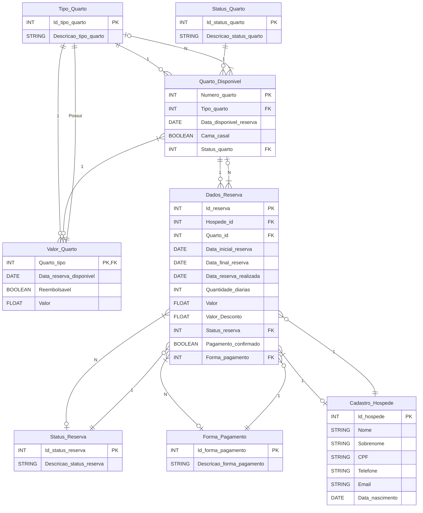

# Diagrama ER

```mermaid
erDiagram
    Tipo_Quarto {
    INT Id_tipo_quarto  PK
    STRING Descricao_tipo_quarto 
    }


    Status_Quarto {
    INT Id_status_quarto  PK
    STRING Descricao_status_quarto 
    }


        Status_Reserva {
    INT Id_status_reserva  PK
    STRING Descricao_status_reserva  
    }

        Forma_Pagamento {
    INT Id_forma_pagamento  PK
    STRING Descricao_forma_pagamento 
    }

        Quarto_Disponivel {
    INT Numero_quarto  PK
    INT Tipo_quarto FK
    DATE Data_disponivel_reserva 
    BOOLEAN Cama_casal 
    INT Status_quarto FK
    }

        Valor_Quarto {
    INT Quarto_tipo  PK, FK
    DATE Data_reserva_disponivel 
    BOOLEAN Reembolsavel 
    FLOAT Valor 
    }

        Cadastro_Hospede {
    INT Id_hospede  PK
    STRING Nome 
    STRING Sobrenome 
    STRING CPF 
    STRING Telefone 
    STRING Email 
    DATE Data_nascimento 
    }

        Dados_Reserva {
    INT Id_reserva  PK
    INT Hospede_id FK
    INT Quarto_id FK
    DATE Data_inicial_reserva 
    DATE Data_final_reserva 
    DATE Data_reserva_realizada 
    INT Quantidade_diarias 
    FLOAT Valor 
    FLOAT Valor_Desconto 
   INT  Status_reserva FK
    BOOLEAN Pagamento_confirmado 
   INT  Forma_pagamento FK


    }


    Valor_Quarto ||--|| Tipo_Quarto : "Possui"

    Tipo_Quarto ||--o{ Quarto_Disponivel : "1"
    Tipo_Quarto ||--o{ Valor_Quarto : "1"

    Status_Quarto ||--o{ Quarto_Disponivel : "1"


    Status_Reserva ||--o{ Dados_Reserva : "1"


    Forma_Pagamento ||--o{ Dados_Reserva : "1"


    Quarto_Disponivel ||--o{ Dados_Reserva : "1"
    Quarto_Disponivel }|--o{ Valor_Quarto : "1"
    Quarto_Disponivel }|--o| Tipo_Quarto : "N"


    Cadastro_Hospede ||--o{ Dados_Reserva : "1"

 
    Dados_Reserva }|--o| Status_Reserva : "N"
    Dados_Reserva }|--o| Quarto_Disponivel : "N"
    Dados_Reserva }|--o| Forma_Pagamento : "N"
    Dados_Reserva }|--o| Cadastro_Hospede : "1"


```